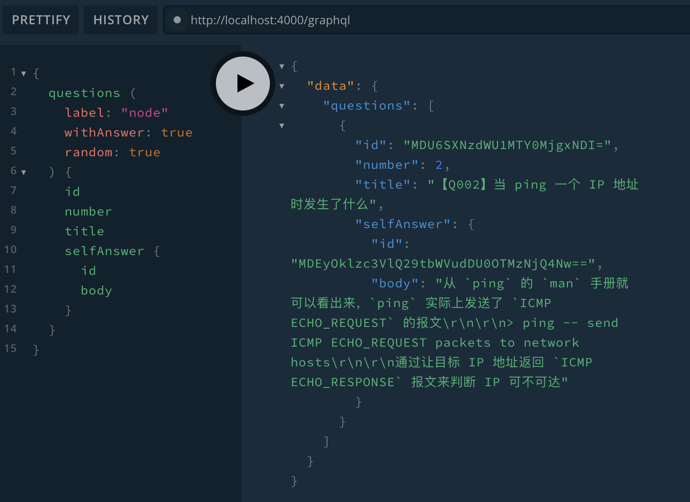

# GraphQL API for Daily-Question

这是关于 [面试每日一题](https://github.com/shfshanyue/Daily-Question) 提供的 GraphQL 接口

## Script

## Query



更多文档查看 [GraphQL Playground and Documentation](https://interview.shanyue.tech/graphql)

### 获取所有面试题

``` gql
query QUESTIONS {
  questions (
    label: "node"
    withAnswer: true
    random: true
  ) {
    id
    number
    title
    selfAnswer {
      id
      body
    }
  }
}
```

### 获取某道面试题

``` gql
query QUESTION {
  question (number: 3) {
    id
    number
    title
    body
    selfAnswer {
      id
      author
      body
    }
  }
}
```
## Deploy

本项目部署在腾讯云 serverless 中，访问地址: <https://interview.shanyue.tech/graphql>

部署资源配置文件 `serverless.yml` 如下所示:

``` yml
component: express # (required) name of the component. In that case, it's express.
name: Daily-Question-GraphQL # (required) name of your express component instance.
org: shanyue

inputs:
  src: ./ # (optional) path to the source folder. default is a hello world app.
  functionName: interview-questions
  region: ap-shanghai
  runtime: Nodejs12.16
  exclude:
    - .env
    - "**/*.ts"
  apigatewayConf:
    protocols:
      - http
      - https
    environment: release
    enableCORS: true #  允许跨域
    customDomains: # 自定义域名绑定
      - domain: interview.shanyue.tech
        certificateId: e1nq0FQp
        isDefaultMapping: 'FALSE'
        pathMappingSet:
          - path: /
            environment: release
        protocols: # 绑定自定义域名的协议类型，默认与服务的前端协议一致。
          - http # 支持http协议
          - https # 支持https协议
 ```
